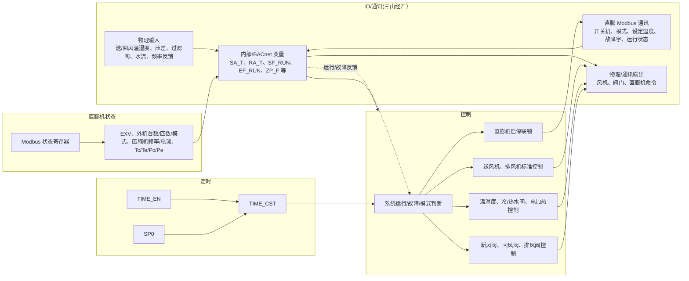
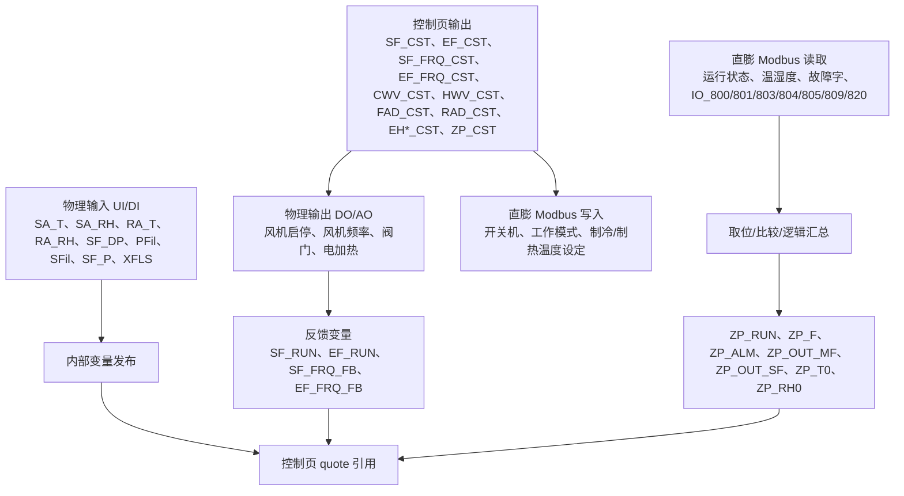
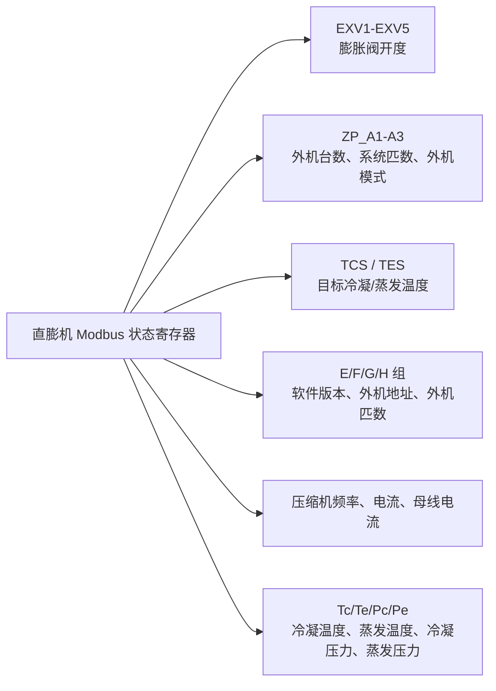
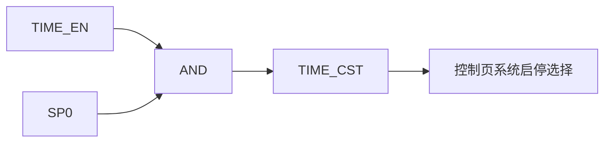
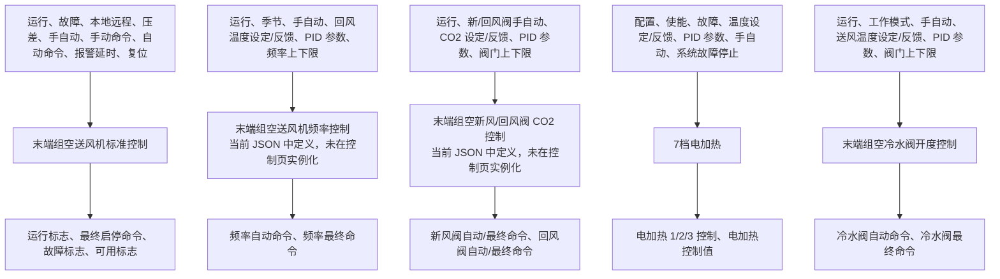

# flows_20251210190941 流程图

来源文件：`programs/AHU程序/三山经开区/flows_20251210190941.json`

说明：原始导出包含 4 个工作页、5 个子流程、913 个节点。下面按业务块合并绘制，避免把每个 `swInput`、`quote`、`limit`、`PID` 等低层节点全部展开成不可读的大图。

## 已渲染图片

- [项目总览](flowchart_images/01_project_overview.svg)
- [控制页主流程](flowchart_images/02_control_main_flow.svg)
- [IO/通讯页流程](flowchart_images/03_io_communication.svg)
- [直膨机状态页流程](flowchart_images/04_dx_status.svg)
- [定时页流程](flowchart_images/05_timer.svg)
- [子流程用途](flowchart_images/06_subflows.svg)

## 项目总览

## 控制页主流程

```mermaid
flowchart TD
    SYS_LR["SYS_LR<br/>本地/远程"] --> SYS_CMD_SEL["系统命令选择"]
    SYS_MC["SYS_MC / M_SYS_MC<br/>手动启停"] --> SYS_CMD_SEL
    TIME_CST["TIME_CST<br/>定时允许"] --> SYS_CMD_SEL

    ZP_F["ZP_F<br/>直膨总故障"] --> SYS_FAULT["系统故障 OR"]
    SF_MF["SF_MF<br/>送风机故障"] --> SYS_FAULT
    XFLS["XFLS<br/>水流/联锁异常"] --> SYS_FAULT
    SYS_FAULT --> SYS_F["SYS_F<br/>系统故障"]
    SYS_F --> SYS_RUN_BLOCK["故障取反联锁"]
    SYS_CMD_SEL --> SYS_RUN_BLOCK
    SYS_RUN_BLOCK --> SYS_RUN["SYS_RUN<br/>系统运行"]

    SYS_RUN --> OPEN_VALVE["开阀"]
    OPEN_VALVE --> SF_DELAY["送风机启停延时<br/>SF_DT0 / SF_DT1"]
    SF_DELAY --> SF_AUTO["开风机"]
    SF_AUTO --> SF_STD["子流程：末端组空送风机标准控制"]
    SF_RUN_FB["SF_RUN"] --> SF_STD
    SF_F_FB["SF_F"] --> SF_STD
    SF_LR_FB["SF_LR"] --> SF_STD
    SF_DP_FB["SF_DP"] --> SF_STD
    SF_AM_MC["SF_AM / SF_MC"] --> SF_STD
    SF_STD --> SF_C["SF_C"]
    SF_C --> SF_CST["SF_CST"]
    SF_STD --> SF_ALM["SF_ALM / SF_MF"]
    SF_RUN_FB --> SF_RT["SF_RT<br/>运行时间"]

    SYS_RUN --> EF_AUTO["开排风机"]
    EF_AUTO --> EF_STD["子流程：末端组空送风机标准控制<br/>用于排风机"]
    EF_RUN_FB["EF_RUN"] --> EF_STD
    EF_F_FB["EF_F"] --> EF_STD
    EF_DP_FB["EF_DP"] --> EF_STD
    EF_AM_MC["EF_AM / EF_MC"] --> EF_STD
    EF_STD --> EF_C["EF_C"]
    EF_C --> EF_CST["EF_CST"]
    EF_STD --> EF_ALM["EF_MF / EF_CST"]

    SYS_RUN --> ZP_ENABLE["直膨启停联锁"]
    SF_RUN_FB --> ZP_ENABLE
    ZP_AM_MC["ZP_AM / ZP_MC"] --> ZP_ENABLE
    SYS_FAULT --> ZP_ENABLE
    ZP_ENABLE --> ZP_CST["ZP_CST"]

    SYS_MOD_SP["SYS_MOD_SP"] --> MOD_LIMIT["模式限值/除湿切换"]
    HUM_CL["HUM_CL<br/>除湿请求"] --> MOD_LIMIT
    MOD_LIMIT --> SYS_MOD["SYS_MOD<br/>0关机 1通风 2制冷 3制热 5自动"]

    SYS_T_SP["SYS_T_SP"] --> T_LIMIT["温度设定限值 17-30"]
    T_LIMIT --> SYS_T["SYS_T"]
    SYS_RH_SP["SYS_RH_SP"] --> RH_LIMIT["湿度设定限值 30-75"]
    RH_LIMIT --> SYS_RH["SYS_RH"]

    FR_SW["FR_SW<br/>送/回风选择"] --> CTRL_T_RH["控制温湿度选择"]
    ZP_EN0["ZP_EN0<br/>是否使用直膨反馈"] --> CTRL_T_RH
    SA_RA["SA_T/SA_RH 或 RA_T/RA_RH"] --> CTRL_T_RH
    ZP_TRH["ZP_T0 / ZP_RH0"] --> CTRL_T_RH
    CTRL_T_RH --> CTRL_TEMP["控制温度 / 控制湿度"]

    SF_P_SP["SF_P_SP"] --> SF_PID["送风静压 PID"]
    SF_P["SF_P"] --> SF_PID
    SF_PID_PARAM["SF_PID1-5、上下限、手自动"] --> SF_PID
    SF_RUN_FB --> SF_PID
    SF_PID --> SF_FRQ_CST["SF_FRQ_CST"]

    SYS_MOD --> WATER_VALVE["子流程：末端组空冷水阀开度控制"]
    SYS_T --> WATER_VALVE
    CW_T1["CW_T1"] --> WATER_VALVE
    WV_PARAM["WV_PID1-5、WV_MAX、WV_MIN"] --> WATER_VALVE
    WATER_VALVE --> WATER_AC["水阀开度控制"]
    WATER_AC --> CWV_AC["制冷模式：CWV_AC"]
    WATER_AC --> HWV_AC["制热模式：HWV_AC"]
    CWV_AM_MC["CWV_AM / CWV_MC"] --> CWV_CST["CWV_CST"]
    CWV_AC --> CWV_CST
    HWV_AM_MC["HWV_AM / HWV_MC"] --> HWV_CST["HWV_CST"]
    HWV_AC --> HWV_CST

    HUM_EN["HUM_EN"] --> HUM_PID["湿度 PID / 除湿判断"]
    SYS_RH --> HUM_PID
    CTRL_TEMP --> HUM_PID
    HUM_PID_PARAM["HUM_PID1-5、HUM_MIN/MAX、HUM_AM/MC"] --> HUM_PID
    HUM_PID --> HUM_CST["HUM_CST"]
    HUM_PID --> HUM_CL

    EH_EN["EH_EN"] --> EH_ENABLE["电加热使能"]
    SYS_MOD --> EH_ENABLE
    SYS_RUN --> EH_ENABLE
    SF_RUN_FB --> EH_ENABLE
    HUM_CL --> EH_ENABLE
    EH_ENABLE --> EH_SUB["子流程：7档电加热"]
    SYS_T --> EH_SUB
    CTRL_TEMP --> EH_SUB
    EH_PARAM["EH_PID1-5、EH_AM/MC、EH_F、SYS_F"] --> EH_SUB
    EH_SUB --> EH1["EH1_CST"]
    EH_SUB --> EH2["EH2_CST"]
    EH_SUB --> EH3["EH3_CST"]
    EH_SUB --> EH_C["EH_C"]

    OPEN_VALVE --> AD_AC["AD_AC<br/>风阀自动控制"]
    AD_AC --> FAD_PATH["新风阀控制"]
    FAD_AM_MC["FAD_AM / FAD_MC"] --> FAD_PATH
    FAD_LIMIT["FAD_MAX / FAD_MIN"] --> FAD_PATH
    FAD_PATH --> FAD_CST["FAD_CST"]
    FAD_CST --> FAD_ALM["FAD_ALM<br/>命令与开度反馈不一致报警"]

    AD_AC --> RAD_PATH["回风阀控制"]
    RAD_AM_MC["RAD_AM / RAD_MC"] --> RAD_PATH
    RAD_LIMIT["RAD_MAX / RAD_MIN"] --> RAD_PATH
    RAD_PATH --> RAD_CST["RAD_CST"]
```

## IO/通讯页流程

## 直膨机状态页流程

## 定时页流程

## 子流程用途

